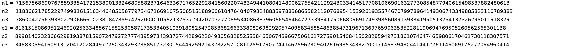

## Old Monitor (Crypto, 135pts)  
# Enumeration
The challenge description gives us a big hint on what the challenge actually is about:

```
I have this old CRT monitor that I use for my desktop computer. It crashed on me and spit out all these weird numbers…
```
# Process of thought
Looking at the file which is an image we do understand thats it's probably either some attack on RSA or on Diffie Hellman's key exchange. Considering the fact that it talks about CRT and that we are provided with just the N and the ciphertext , the idea that came to my mind is that this is a Chinese Remainder Theorem attack on RSA.


# Attacking the RSA
So using an online OCR (I wouldn't write the numbers by hand...) I took the N and C values.
Time to write a script to break it
```import gmpy

e = 3

n1 = 7156756869076785933541721538001332468058823716463367176522928415602207483494410804148006276542112924303341451770810669016327730854877940615498537882480613 
n2 = 11836621785229749981615163446485056779734671669107550651518896061047640407932488359788368655821120768954153926193557467079978964149306743349885823110789383 
n3 = 7860042756393802290666610238184735974292004010562137537294207072770895340863879606654646472733984175066809691749398560891393841950513254137326295011918329 
c1 = 816151508695124692025633485671582530587173533405103918082547285368266333808269829205740958345854863854731967136976590635352281190694769505260562565301138 
c2 = 8998140232866629819387815907247927277743959734393727442896220493056828525538465067439667506161727590154084150282859497318610746474659806170461730118307571 
c3 = 3488305941609131204120284497226034329328885177230154449259214328225710811259179072441462596230940261693534332200171468394304414412261146069175272094960414 


N = n1 * n2 * n3
N1 = N/n1
N2 = N/n2
N3 = N/n3

u1 = gmpy.invert(N1,n1)
u2 = gmpy.invert(N2,n2)
u3 = gmpy.invert(N3,n3)

M = (c1*u1*N1 + c2*u2*N2 + c3*u3*N3) % N

m = gmpy.root(M,e)[0]

print hex(m)[2:].rstrip("L").decode("hex")
```

And... it worked

```LLS{the_chinese_remainder_theorem_is_so_cool}```

