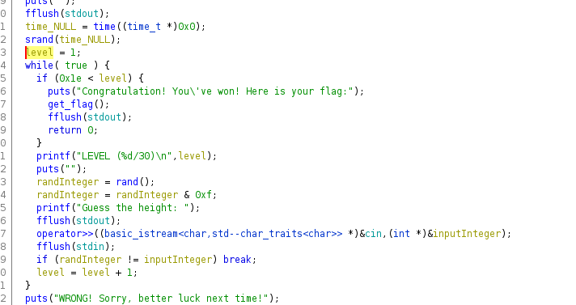

## Seed Spring (Pwn, 150pts)  
# Enumeration

From the name of the challenge I did understand that it has to do with some seed value,
so that's possibly a srand() exploitation or something similar. My next step was to reverse
engineer the binary opening it in Ghidra and changing some variable names to understand what it 
actually does.



Even though the code after the decompilation is self explanatory let's give a brief overview,
so what it does is that it securely generates a seed using the current time **srand(time(NULL));**
so that's not vulnerable to any attack. But, what is exploitable is that after it calls **rand();**
function to generate an integer it executes an AND logical operation with 0xf. Let's dive into this 

For our example let's suppose that we are on a 32-bit machine:
A random integer has the size of 4 bytes (X stands for unknown byte and y for uknown bit),
if we perform an AND operation on it with 0xF, then what we are actually doing is that we are masking only for the five last bits of our integer.
```

        0xXXX YYYYYYYY
    &         00011111
    -----------------
        0x000 000YYYYY
```
# So how is this exploitable ?
With such a small range of numbers, (16) no matter how secure our seed generation is, 
we can pretty much predict its output by executing a seed generation in approximately the same time to the one
on the server side. Since the loss of information on the output is massive 
because of the AND operation the difference in time between the execution of the two scripts can be ignored. 

# Exploitation

I also did a reverse look up on the DNS just to talk directly to the IP just to save some time on the communication.


```
import math
from ctypes import CDLL
from pwn import *
def get_Random():
	return libc.rand()


libc = CDLL('libc.so.6')

p = remote('167.172.3.35',50010)
now = int(math.floor(time.time()))
libc.srand(now)
for i in range(30):
	p.recvuntil('Guess the height: ')
	p.sendline(str(get_Random() & 0xf))

p.recvline()
```

By executing the script above...
we get our flag

```LLS{pseudo_random_number_generator_not_so_random}```

