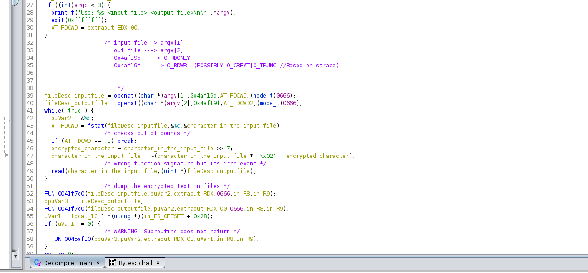

# Overview
We are given a binary file (chall) as long as an encrypted text (flag.enc),
the name of the challenge is pretty clear it is a simple encryptor we have to reverse to get the flag
running file on the binary tells us that is stripped

### Enumeration

```
shad3@zeroday:~/Desktop/CTF/fireshell/rev$ file chall
chall: ELF 64-bit LSB executable, x86-64, version 1 (GNU/Linux), statically linked, BuildID[sha1]=f3c364778bd1d6a73cdf93b1a164039dba7176bf, for GNU/Linux 3.2.0, stripped
```


My first thought was to create a string of some size containing only null bytes trying to encrypt it just to see
how the programm will react


```
shad3@zeroday:~/Desktop/CTF/fireshell/rev$ python -c "print '\x00' * 64" > test
shad3@zeroday:~/Desktop/CTF/fireshell/rev$ xxd test
00000000: 0000 0000 0000 0000 0000 0000 0000 0000  ................
00000010: 0000 0000 0000 0000 0000 0000 0000 0000  ................
00000020: 0000 0000 0000 0000 0000 0000 0000 0000  ................
00000030: 0000 0000 0000 0000 0000 0000 0000 0000  ................
00000040: 0a                                       .
shad3@zeroday:~/Desktop/CTF/fireshell/rev$ ./chall test test.out

_______ _____ _______  _____         _______
|______   |   |  |  | |_____] |      |______
______| __|__ |  |  | |       |_____ |______

_______ __   _ _______  ______ __   __  _____  _______  _____   ______
|______ | \  | |       |_____/   \_/   |_____]    |    |     | |_____/
|______ |  \_| |_____  |    \_    |    |          |    |_____| |    \_

shad3@zeroday:~/Desktop/CTF/fireshell/rev$ xxd test.out 
00000000: ffff ffff ffff ffff ffff ffff ffff ffff  ................
00000010: ffff ffff ffff ffff ffff ffff ffff ffff  ................
00000020: ffff ffff ffff ffff ffff ffff ffff ffff  ................
00000030: ffff ffff ffff ffff ffff ffff ffff ffff  ................
00000040: eb                                       .

```


That's interesting it's turning them into \xff. **NOTED!**

By doing strace (pretty important on stripped binaries) we realise that it calls:


```
openat(AT_FDCWD, "test", O_RDONLY)      = 3
openat(AT_FDCWD, "test.out", O_RDWR|O_CREAT|O_TRUNC, 0666) = 4
fstat(3, {st_mode=S_IFREG|0644, st_size=65, ...}) = 0
read(3, "\0\0\0\0\0\0\0\0\0\0\0\0\0\0\0\0\0\0\0\0\0\0\0\0\0\0\0\0\0\0\0\0"..., 4096) = 65
fstat(4, {st_mode=S_IFREG|0644, st_size=0, ...}) = 0
read(3, "", 4096)                       = 0
close(3)                                = 0
write(4, "\377\377\377\377\377\377\377\377\377\377\377\377\377\377\377\377\377\377\377\377\377\377\377\377\377\377\377\377\377\377\377\377"..., 65) = 65
close(4)                                = 0
exit_group(0)                           = ?
```
Ok so we know now that it opens the 2 files gets some info from the input file, reads from the input file something
and then writes the encrypted text to the output. Ok cool! now let's open in it on ghidra to dig into the algorithm.


After some renaming variables, changing function signatures etc. the algorithm takes the following form:


###Final Step 
Lets pwn it, I wrote a quick script to break it and :
Since all it does is that it shifts-left the byte that it reads and then does and OR with the multiplied by 2 same variable
all we can do is just reverse it with the following script:

```
with open('flag.enc','rb') as f:
	enc_flag = f.read()

f.close()

flag=''

for enc_character in enc_flag:
	for i in range(0xff):
		
		
		a = i >> 7
		final  = i * 0x02 | a
		if (255 - final) == enc_character:
			flag += chr(i)
			


print(flag)
```